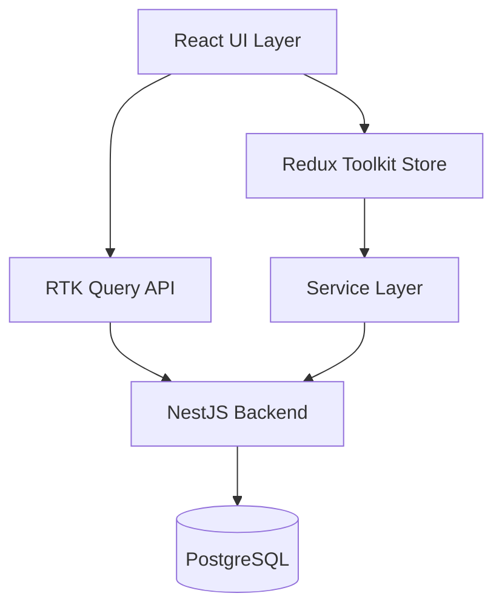

# 🏗️ Architecture Guide

Comprehensive overview of the system architecture, design patterns, and technical decisions.

## System Overview



## 🎯 Architecture Principles

### SOLID Principles

#### Single Responsibility Principle (SRP)
Each module has one reason to change:

```typescript
// ✅ Good: Single responsibility
export const EventCard = ({ event, onSelect }) => {
  // Only responsible for displaying event
}

export const useEventSelection = () => {
  // Only responsible for selection logic
}
```

#### Open/Closed Principle (OCP)
Components are open for extension, closed for modification:

```typescript
// Base component extensible via props
interface CardProps {
  variant?: 'default' | 'compact' | 'detailed'
  className?: string
  children: React.ReactNode
}
```

#### Liskov Substitution Principle (LSP)
Derived components can replace base components:

```typescript
// All card components share same interface
<Card /> // Base card
<EventCard /> // Can replace Card
<CityCard />  // Can replace Card
```

#### Interface Segregation Principle (ISP)
Clients shouldn't depend on unused interfaces:

```typescript
// Focused interfaces
interface Searchable {
  onSearch: (query: string) => void
}

interface Pageable {
  onPageChange: (page: number) => void
}
```

#### Dependency Inversion Principle (DIP)
Depend on abstractions, not concretions:

```typescript
// Service abstraction
interface PaymentService {
  processPayment(request: PaymentRequest): Promise<PaymentResponse>
}

// Implementation can be swapped
class StripePaymentService implements PaymentService {}
class PayPalPaymentService implements PaymentService {}
```

## 📁 Project Structure

### Layer Architecture

```
src/
├── 🎨 Presentation Layer
│   ├── components/     # UI components
│   ├── routes/        # Page components
│   └── layouts/       # Layout components
│
├── 🏪 State Management Layer
│   ├── store/         # Redux store
│   ├── slices/        # Feature slices
│   └── api/           # RTK Query
│
├── 💼 Business Logic Layer
│   ├── services/      # Business services
│   ├── hooks/         # Custom hooks
│   └── utils/         # Utilities
│
└── 🔧 Infrastructure Layer
    ├── config/        # Configuration
    ├── types/         # TypeScript types
    └── mock/          # Mock data
```

### Feature-Based Organization

```
features/
├── events/
│   ├── components/    # Event components
│   ├── hooks/        # Event hooks
│   ├── services/     # Event services
│   └── types/        # Event types
│
├── cities/
│   ├── components/    # City components
│   ├── hooks/        # City hooks
│   └── types/        # City types
│
└── payments/
    ├── components/    # Payment components
    ├── services/     # Payment services
    └── types/        # Payment types
```

## 🎨 Design Patterns

### 1. Container/Presentational Pattern

Separation of data logic from UI:

```typescript
// Container Component (Smart)
const EventListContainer = () => {
  const { data, isLoading } = useGetEventsQuery()
  const dispatch = useAppDispatch()
  
  return <EventList events={data} onSelect={...} />
}

// Presentational Component (Dumb)
const EventList = ({ events, onSelect }) => {
  return events.map(event => 
    <EventCard key={event.id} {...event} />
  )
}
```

### 2. Custom Hook Pattern

Reusable business logic:

```typescript
// Custom hook for event management
export const useEventManagement = () => {
  const dispatch = useAppDispatch()
  const events = useAppSelector(selectEvents)
  
  const selectEvent = useCallback((event) => {
    dispatch(setSelectedEvent(event))
  }, [dispatch])
  
  return { events, selectEvent }
}
```

### 3. Compound Component Pattern

Related components working together:

```typescript
// Compound components
<Event>
  <Event.Header />
  <Event.Body />
  <Event.Footer />
</Event>
```

### 4. Render Props Pattern

Flexible component rendering:

```typescript
<DataProvider
  render={(data) => <EventList events={data} />}
/>
```

### 5. Higher-Order Component Pattern

Component enhancement:

```typescript
const withAuth = (Component) => {
  return (props) => {
    const { isAuthenticated } = useAuth()
    if (!isAuthenticated) return <Login />
    return <Component {...props} />
  }
}
```

## 🏪 State Management Architecture

### Redux Toolkit Structure

```typescript
// Store configuration
export const store = configureStore({
  reducer: {
    events: eventSlice.reducer,
    cities: citySlice.reducer,
    [apiSlice.reducerPath]: apiSlice.reducer
  },
  middleware: (getDefaultMiddleware) =>
    getDefaultMiddleware().concat(apiSlice.middleware)
})
```

### Feature Slice Pattern

```typescript
const eventSlice = createSlice({
  name: 'events',
  initialState,
  reducers: {
    setEvents: (state, action) => {
      state.events = action.payload
    }
  },
  extraReducers: (builder) => {
    // Handle async thunks
  }
})
```

### RTK Query Integration

```typescript
const apiSlice = createApi({
  reducerPath: 'api',
  baseQuery: fetchBaseQuery({ baseUrl: '/api' }),
  tagTypes: ['Event', 'City'],
  endpoints: (builder) => ({
    getEvents: builder.query({
      query: (params) => ({ url: '/events', params }),
      providesTags: ['Event']
    })
  })
})
```

## 🔄 Data Flow

### Unidirectional Data Flow

```
User Action → Dispatch → Reducer → Store → UI Update
     ↑                                          ↓
     ←────────────── Re-render ←───────────────
```

### RTK Query Data Flow

```
Component → Hook → Cache Check → API Call → Cache Update → Component
              ↓                      ↑
          Cache Hit ─────────────────
```

## 🎯 Performance Architecture

### Code Splitting Strategy

```typescript
// Route-level splitting
const HomePage = lazy(() => import('./routes/HomePage'))
const EventsPage = lazy(() => import('./routes/EventsPage'))

// Component-level splitting
const HeavyComponent = lazy(() => import('./components/HeavyComponent'))
```

### Memoization Strategy

```typescript
// Component memoization
const EventCard = React.memo(({ event }) => {
  // Render only when event changes
})

// Selector memoization
const selectFilteredEvents = createSelector(
  [selectEvents, selectFilter],
  (events, filter) => events.filter(...)
)
```

### Caching Strategy

```typescript
// RTK Query caching
endpoints: (builder) => ({
  getEvents: builder.query({
    query: (params) => ({ url: '/events', params }),
    keepUnusedDataFor: 300, // 5 minutes
  })
})
```

## 🔐 Security Architecture

### Authentication Flow

```
User Login → Clerk Auth → JWT Token → API Requests
                ↓
          Session Storage
```

### Payment Security

```
Client → Payment Request → Server Validation → Stripe API
   ↑                            ↓
   ←──── Session URL ←──── Response
```

### Data Validation

```typescript
// Zod schema validation
const eventSchema = z.object({
  name: z.string().min(1),
  price: z.number().positive(),
  date: z.date()
})

// Runtime validation
const validatedData = eventSchema.parse(data)
```

## 🔌 API Architecture

### Service Layer Pattern

```typescript
// API Service
class EventApiService {
  async getEvents(params: EventParams): Promise<Event[]> {
    const response = await fetch('/api/events', { params })
    return response.json()
  }
}

// Facade pattern for complex operations
class EventFacade {
  constructor(
    private eventService: EventApiService,
    private cacheService: CacheService
  ) {}
  
  async getEventsWithCache(params) {
    const cached = await this.cacheService.get(params)
    if (cached) return cached
    
    const events = await this.eventService.getEvents(params)
    await this.cacheService.set(params, events)
    return events
  }
}
```

## 🧪 Testing Architecture

### Testing Strategy

```
Unit Tests → Integration Tests → E2E Tests
    70%           20%              10%
```

### Test Structure

```typescript
describe('EventCard', () => {
  it('should display event information', () => {
    // Arrange
    const event = mockEvent()
    
    // Act
    render(<EventCard event={event} />)
    
    // Assert
    expect(screen.getByText(event.name)).toBeInTheDocument()
  })
})
```

## 📊 Monitoring Architecture

### Performance Monitoring

```typescript
// Performance observer
const observer = new PerformanceObserver((list) => {
  list.getEntries().forEach((entry) => {
    console.log(`${entry.name}: ${entry.duration}ms`)
  })
})
```

### Error Boundary

```typescript
class ErrorBoundary extends React.Component {
  componentDidCatch(error, errorInfo) {
    // Log to monitoring service
    logErrorToService(error, errorInfo)
  }
}
```

## 🚀 Deployment Architecture

### Build Pipeline

```
Code → Lint → Type Check → Test → Build → Deploy
        ↓         ↓         ↓       ↓        ↓
      ESLint    TSC      Jest    Vite    Vercel
```

### Environment Strategy

```
Development → Staging → Production
localhost     preview    live
```

## 📈 Scalability Considerations

1. **Micro-frontend Ready** - Module federation support
2. **API Gateway Pattern** - Ready for microservices
3. **Event-Driven Architecture** - WebSocket support
4. **Horizontal Scaling** - Stateless components
5. **CDN Integration** - Static asset optimization

---

For implementation details, see [State Management Guide](./STATE_MANAGEMENT.md) and [API Reference](./API.md).